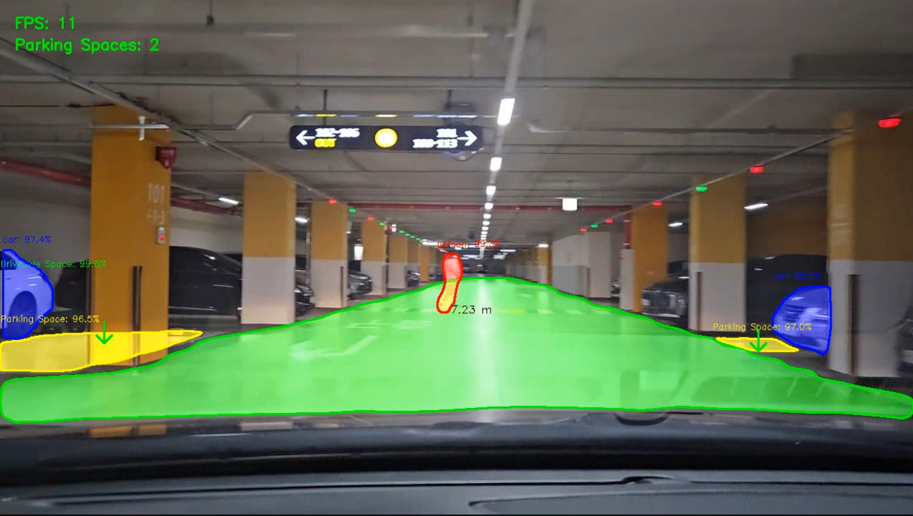
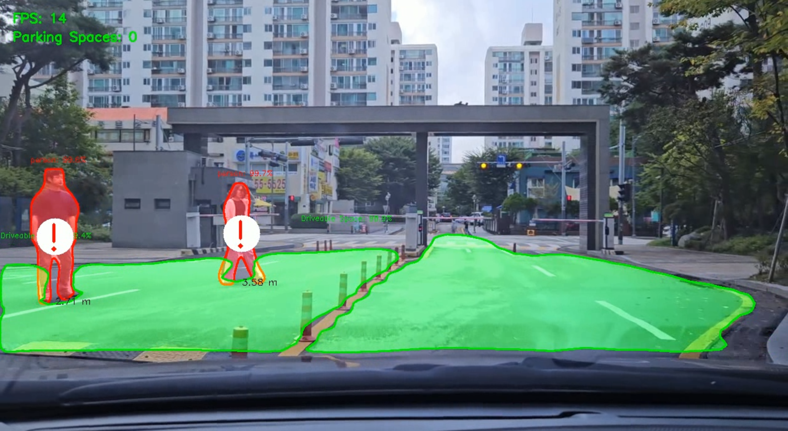

# Parking space detection project

## 이미지 처리 및 객체 인식을 활용한 주차 공간 탐지 프로젝트

Detectron을 사용한 주행 가능 공간, 주차 공간 탐지 및 주차 자리 개수 탐지, 위험 거리 사람 알림 서비스

## Results

# Reference

https://github.com/matterport/Mask_RCNN

https://github.com/facebookresearch/detectron2?tab=readme-ov-file

https://github.com/kairess/Mask_RCNN
